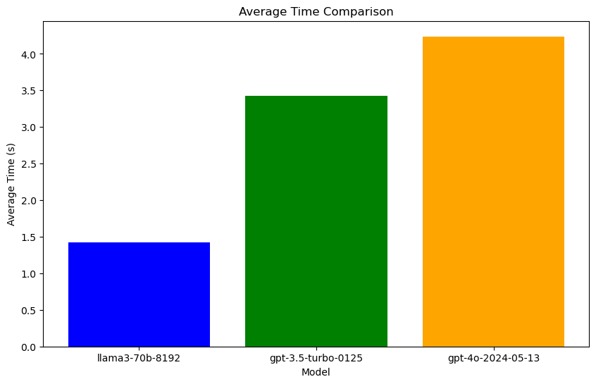
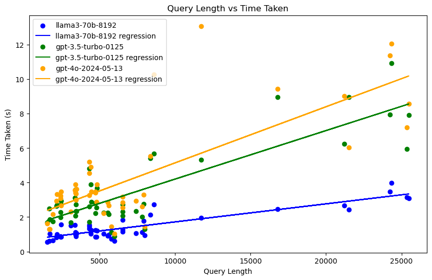

# 大模型横评

[🌍English Global](README.md)

本文将简要比较三种模型在平均处理时间、失败率以及查询长度与处理时间增长之间的差异。


# 参数设置

对比的三个模型是

````python
models = ["llama3-70b-8192", "gpt-3.5-turbo-0125", "gpt-4o-2024-05-13"]
````

其中`llama3-70b-8192`使用的是Groq API，`gpt`使用的是 OpenAI API。API使用方式均为Python Client Library，如下

````python
groq_client = Groq(
    api_key=os.environ["GROQ_API_KEY"],
)

openai_client = OpenAI(api_key=os.environ.get("OPENAI_API_KEY"))
````


测试集将使用名为 `logs.json` 的文件中的前50个条目，并将它们转换为大型模型可以读取的 `messages` 列表。`logs.json`文件不与公开。


# 测试过程

测试将使用循环逐一遍历测试集，并记录查询长度、处理时长和失败率。每测试10个查询将暂停60秒，以避免超过限制的请求速率等问题。测试集不包括相同文本，因此理论上不存在缓存问题。


# 结果

### 数据摘要：






````
Model: llama3-70b-8192
Average time: 1.4226796483993531
Fail rate: 0.0
Overall query: 358776
Model: gpt-3.5-turbo-0125
Average time: 3.4280353021621703
Fail rate: 0.0
Overall query: 358776
Model: gpt-4o-2024-05-13
Average time: 4.238370051383972
Fail rate: 0.0
Overall query: 358776
````


### 详细数据（请见`results.json`）

[results.json](/results.json)


### 最终结论评估

1. **平均响应时间**
   - **llama3-70b-8192**：1.42秒（最快）
   - **gpt-3.5-turbo-0125**：3.43秒（中等）
   - **gpt-4o-2024-05-13**：4.24秒（最慢）

2. **失败率**
   - 所有模型的失败率均为 0.0，没有任何查询失败。

3. **查询长度与响应时间关系**
   - 查询长度与响应时间呈正相关关系。
   - **llama3-70b-8192** 在处理较长查询时响应时间最短，并未出现异常查询时间。
   - **gpt-4o-2024-05-13** 在处理查询时响应时间最长，并出现超过10秒的超长查询时间。

### 综合评价
- **llama3-70b-8192** 在平均响应时间和处理较长查询时的表现最佳。
- **gpt-3.5-turbo-0125** 的响应时间居中，整体性能良好。
- **gpt-4o-2024-05-13** 的响应时间最长，并容易出现波动，但同样具备高可靠性（无失败）。

总体而言，**llama3-70b-8192** 是最优选择，具备最快的响应速度和稳定的性能。


# 局限性
本次测试的局限性包括但不限于以下几点：

1. **测试集规模有限：** 本次测试仅使用了名为 `logs.json` 的文件中的前50个查询，可能无法全面代表真实场景中的查询情况。
2. **文本质量：** 本次测试仅评估返回字段长度大于1的文本作为有效结果，并未对文本质量进行详尽测试。
3. **客户端：** 测试使用了Groq Python Client和OpenAI Python Client。使用其他方法（如POST请求）可能导致不同的结果。

请注意，以上局限性仅针对本次测试的具体条件和设置。在实际应用中，可能还存在其他需要进一步考虑和评估的局限性。


---

<p xmlns:cc="http://creativecommons.org/ns#" xmlns:dct="http://purl.org/dc/terms/"><a property="dct:title" rel="cc:attributionURL" href="https://haozhe-li.github.io/LLM-Comparison/">LLM-Comparison</a> by <a rel="cc:attributionURL dct:creator" property="cc:attributionName" href="https://haozhe.li">Haozhe Li</a> is licensed under <a href="https://creativecommons.org/licenses/by-nc/4.0/?ref=chooser-v1" target="_blank" rel="license noopener noreferrer" style="display:inline-block;">CC BY-NC 4.0</a></p>
