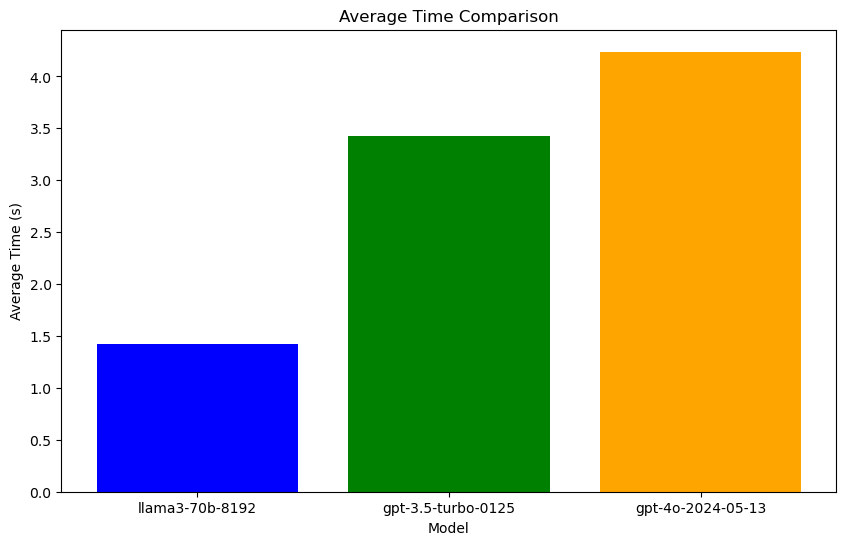
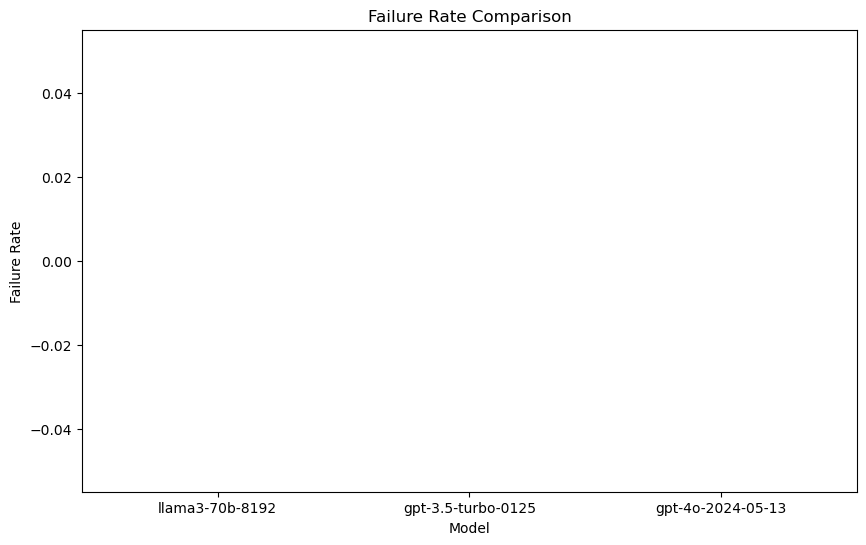
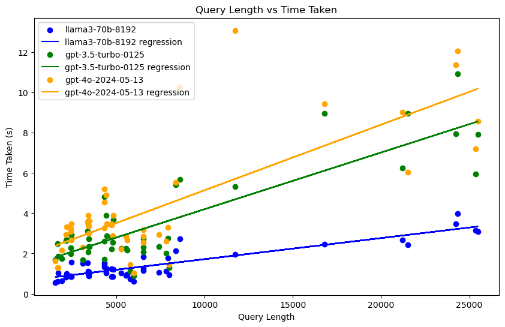

# LLM comparison

[🇨🇳简体中文](README-zh.md)

This article will briefly compare the differences between the three models in terms of average processing time, failure rate, and query length and processing time growth.

# Parameter settings

The three models compared are

````python
models = ["llama3-70b-8192", "gpt-3.5-turbo-0125", "gpt-4o-2024-05-13"]
````

Among them, `llama3-70b-8192` uses the Groq API, and `gpt` uses the OpenAI API. The API usage is Python Client Library, as follows

````python
groq_client = Groq(
api_key=os.environ["GROQ_API_KEY"],
)
openai_client = OpenAI(api_key=os.environ.get("OPENAI_API_KEY"))
````

The test set will use the first 50 entries in a file called `logs.json` and convert them into a `messages` list that can be read by the large model. The `logs.json` file is not public.

# Test process

The test will use a loop to go through the test set one by one, and record the query length, processing time, and failure rate. Every 10 queries will be paused for 60 seconds to avoid problems such as exceeding the request rate limit. The test set does not include the same text, so there is no cache problem in theory.

# Results

### Data summary:







````
Model: llama3-70b-8192
Average time: 1.4226796483993531
Fail rate: 0.0
Overall query: 358776
Model: gpt-3.5-turbo-0125
Average time: 3.4280353021621703
Fail rate: 0.0
Overall query: 358776
Model: gpt-4o-2024-05-13
Average time: 4.238370051383972
Fail rate: 0.0
Overall query: 358776
````

### Detailed data (see `results.json`)

[results.json](/results.json)

### Final conclusion evaluation

1. **Average response time**

- **llama3-70b-8192**: 1.42 seconds (fastest)

- **gpt-3.5-turbo-0125**: 3.43 seconds (medium)

- **gpt-4o-2024-05-13**: 4.24 seconds (slowest)

2. **Failure rate**

- The failure rate of all models is 0.0, and no query fails.

3. **Relationship between query length and response time**

- There is a positive correlation between query length and response time.

- **llama3-70b-8192** has the shortest response time when processing longer queries, and no abnormal query time occurs.

- **gpt-4o-2024-05-13** has the longest response time when processing queries, and has long query times of more than 10 seconds.

### Overall evaluation
- **llama3-70b-8192** performs best in average response time and processing long queries.
- **gpt-3.5-turbo-0125** has a medium response time and good overall performance.
- **gpt-4o-2024-05-13** has the longest response time and is prone to fluctuations, but also has high reliability (no failures).

Overall, **llama3-70b-8192** is the best choice, with the fastest response speed and stable performance.

# Limitations
The limitations of this test include but are not limited to the following:

1. **Limited test set size:** This test only uses the first 50 queries in the file named `logs.json`, which may not fully represent the query situation in real scenarios.
2. **Text quality:** This test only evaluates texts with a return field length greater than 1 as valid results, and does not perform an exhaustive test of text quality.
3. **Client:** The test used Groq Python Client and OpenAI Python Client. Using other methods (such as POST requests) may lead to different results.

Please note that the above limitations are only for the specific conditions and settings of this test. In actual applications, there may be other limitations that require further consideration and evaluation.

---

<p xmlns:cc="http://creativecommons.org/ns#" xmlns:dct="http://purl.org/dc/terms/"><a property="dct:title" rel="cc:attributionURL" href="https://haozhe-li.github.io/LLM-Comparison/">LLM-Comparison</a> by <a rel="cc:attributionURL dct:creator" property="cc:attributionName" href="https://haozhe.li">Haozhe Li</a> is licensed under <a href="https://creativecommons.org/licenses/by-nc/4.0/?ref=chooser-v1" target="_blank" rel="license noopener noreferrer" style="display:inline-block;">CC BY-NC 4.0</a></p>