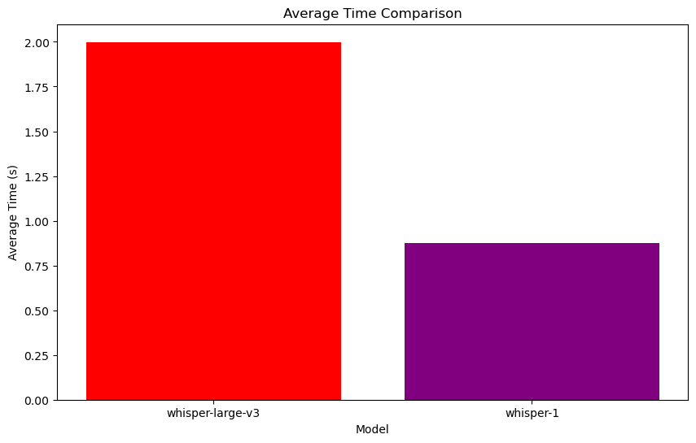
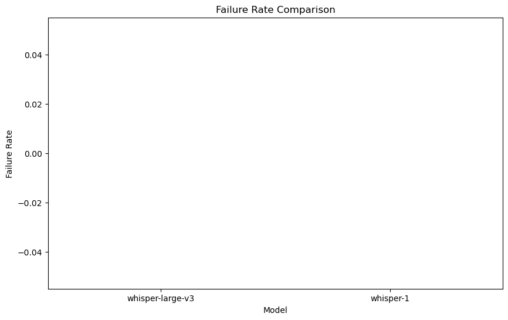
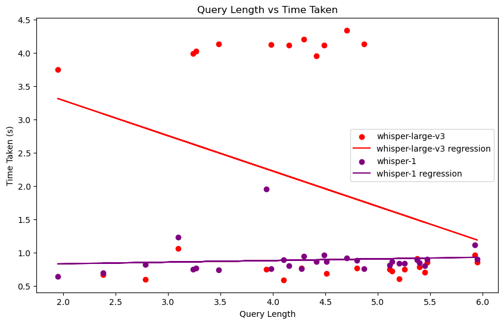

# STT model crosswalk whisper-large-v3 | whisper-1

[🇨🇳简体中文](stt-zh.md)

In this paper, we briefly compare the two models in terms of average processing time, failure rate, and the difference between query length and processing time growth.


## Parameter Settings

The three models compared are

````python
models = ["whisper-large-v3", "whisper-1"]
````

The `whisper-large-v3` uses the Groq API and the `whisper-1` uses the OpenAI API.The API usage is Python Client Library as follows

````python
groq_client = Groq(
    api_key=os.environ["GROQ_API_KEY"],
)

openai_client = OpenAI(api_key=os.environ.get("OPENAI_API_KEY"))
````


The test set will generate languages of different lengths and in both Chinese and English using the 20 TTS named.


## Test Procedure

The test will traverse the test set one by one using a loop and record the query length, processing time and failure rate. Every 10 queries tested will be paused for 60 seconds to avoid issues such as exceeding the limited request rate. The test set does not include identical text, so theoretically there are no caching issues.


## Results

### Summary of data:







| Model            | Average time       | Fail rate | Overall query |
| ---------------- | ------------------ | --------- | ------------- |
| whisper-large-v3 | 1.998681701719761  | 0.0       | 136.296       |
| whisper-1        | 0.8740840554237366 | 0.0       | 136.296       |

### Summary of data analysis

1. **Average time comparison**:
   - whisper-large-v3 average time is 1.9987 seconds.
   - The average time for whisper-1 is 0.8741 seconds.
   - The response time of whisper-1 is significantly lower than that of whisper-large-v3.

2. **Comparison of failure rates**:
   - The failure rate of both models is 0%.

3. **Query length vs. time**:
   - whisper-large-v3 Time hash is too large and unstable, and the variation relationship is not informative.
   - whisper-1 time does not vary much with query length, remains stable and is short.

4. **Total number of queries**:
   - The total number of queries for both models is 136.296.

### Summary
- whisper-1 outperforms whisper-large-v3 with shorter response time and stable failure rate.

---

<p xmlns:cc="http://creativecommons.org/ns#" xmlns:dct="http://purl.org/dc/terms/"><a property="dct:title" rel="cc:attributionURL" href="https://haozhe-li.github.io/LLM-Comparison/">LLM-Comparison</a> by <a rel="cc:attributionURL dct:creator" property="cc:attributionName" href="https://haozhe.li">Haozhe Li</a> is licensed under <a href="https://creativecommons.org/licenses/by-nc/4.0/?ref=chooser-v1" target="_blank" rel="license noopener noreferrer" style="display:inline-block;">CC BY-NC 4.0</a></p>
