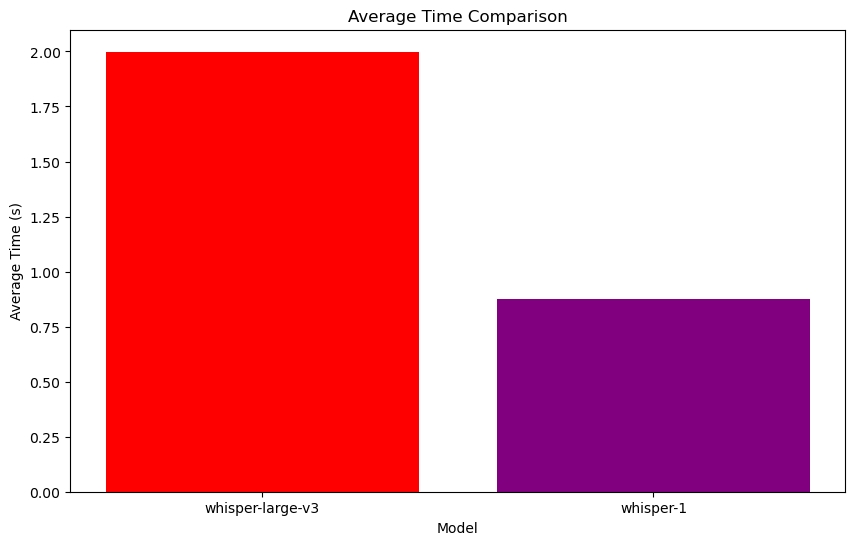

# STT模型横评 whisper-large-v3 | whisper-1

[🌍English Global](sst-en.md)

本文将简要比较两种模型在平均处理时间、失败率以及查询长度与处理时间增长之间的差异。


## 参数设置

对比的三个模型是

````python
models = ["whisper-large-v3", "whisper-1"]
````

其中`llama3-70b-8192`使用的是Groq API，`gpt`使用的是 OpenAI API。API使用方式均为Python Client Library，如下

````python
groq_client = Groq(
    api_key=os.environ["GROQ_API_KEY"],
)

openai_client = OpenAI(api_key=os.environ.get("OPENAI_API_KEY"))
````


测试集将使用名为20条TTS生成不同长短、中英双语的语言。


## 测试过程

测试将使用循环逐一遍历测试集，并记录查询长度、处理时长和失败率。每测试10个查询将暂停60秒，以避免超过限制的请求速率等问题。测试集不包括相同文本，因此理论上不存在缓存问题。


## 结果

### 数据摘要：




| Model            | Average time       | Fail rate | Overall query |
| ---------------- | ------------------ | --------- | ------------- |
| whisper-large-v3 | 1.998681701719761  | 0.0       | 136.296       |
| whisper-1        | 0.8740840554237366 | 0.0       | 136.296       |

### 数据分析总结

1. **平均时间比较**：
   - whisper-large-v3 平均时间为 1.9987 秒。
   - whisper-1 平均时间为 0.8741 秒。
   - whisper-1 的响应时间显著低于 whisper-large-v3。

2. **失败率比较**：
   - 两个模型的失败率均为 0%。

3. **查询长度与时间的关系**：
   - whisper-large-v3 时间散列过大且不稳定，变化关系不具备参考性。
   - whisper-1 时间随查询长度变化不大，保持稳定，且时间较短。

4. **总查询数**：
   - 两个模型的总查询数均为 136.296。

### 总结
- whisper-1 在性能上优于 whisper-large-v3，具有更短的响应时间且保持稳定的失败率。


---

<p xmlns:cc="http://creativecommons.org/ns#" xmlns:dct="http://purl.org/dc/terms/"><a property="dct:title" rel="cc:attributionURL" href="https://haozhe-li.github.io/LLM-Comparison/">LLM-Comparison</a> by <a rel="cc:attributionURL dct:creator" property="cc:attributionName" href="https://haozhe.li">Haozhe Li</a> is licensed under <a href="https://creativecommons.org/licenses/by-nc/4.0/?ref=chooser-v1" target="_blank" rel="license noopener noreferrer" style="display:inline-block;">CC BY-NC 4.0</a></p>