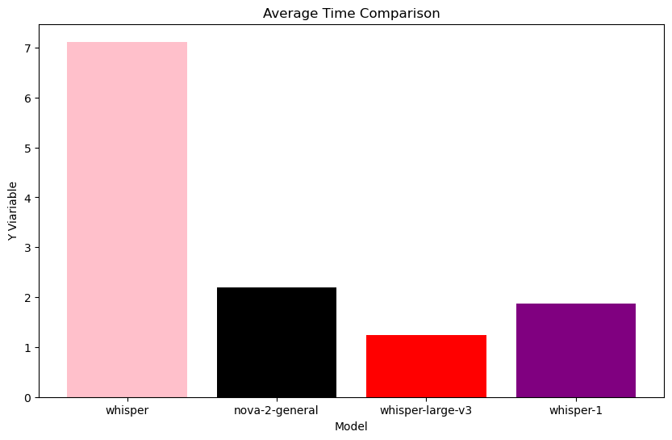
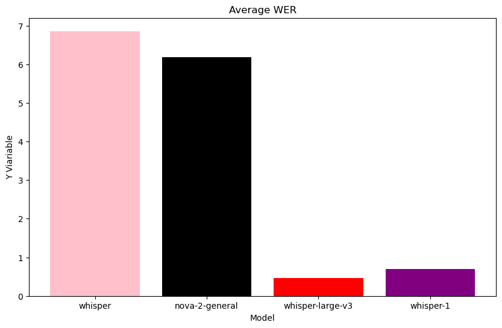
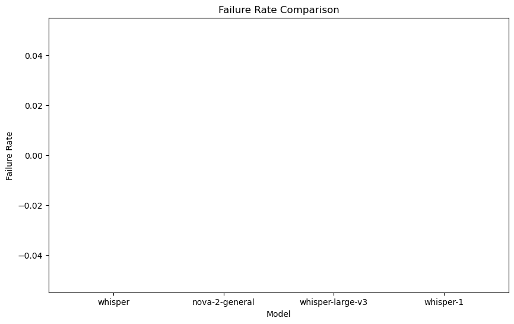
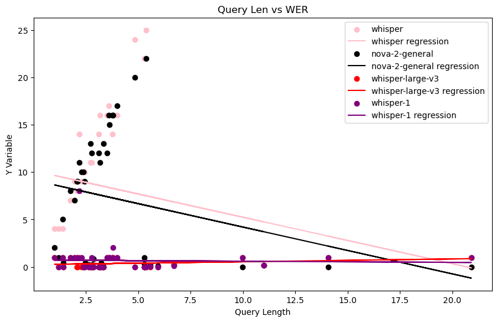
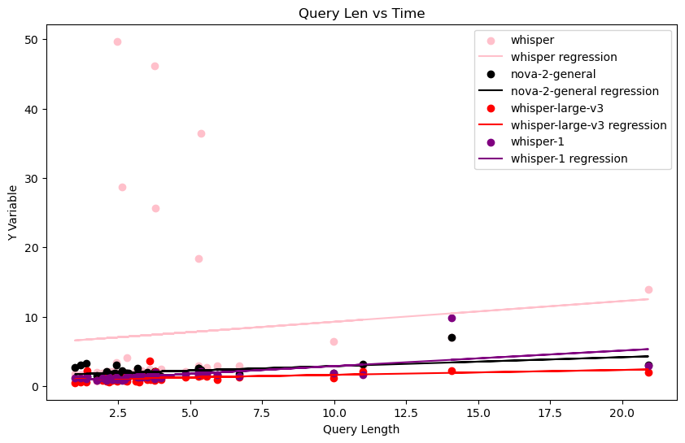

# STT Model Crosswalk V2

[🇨🇳简体中文](sttv2-zh.md)

In this paper, we will briefly compare the differences in the performance of the four models in terms of average processing time, failure rate, query length vs. processing time growth, and average WER (Word Error Rate) vs. change in query length vs. WER.


## Parameter Settings

**Comparison models:**

````python
models = [“whisper”, “nova-2-general”, “whisper-large-v3”, “whisper-1”]
````

``whisper``, ``nova-2-general`` from Deepgram, ``whisper-large-v3`` from Groq, ``whisper-1`` from openai.

**Model parameters:**

``language`` for auto-recognition

All others are defaults.

**Test set:** 50 items in total, including empty speech, Chinese, Japanese and English at different lengths. The voices are generated by TTS and read by real people. If the model hallucinates when testing empty speech, the relative WER will be 100%.

## Testing Procedure

The test will use a loop to traverse the test set one by one and record the query length, processing time, failure rate, and WER. every 10 queries tested will be paused for 60 seconds to avoid problems such as exceeding the limited request rate. The test set does not include identical text, so theoretically there are no caching issues.


## Results

### Summary of data:












| Model            | Average Time       | Average WER        | Fail Rate | Overall Query |
| ---------------- | ------------------ | ------------------ | --------- | ------------- |
| whisper          | 7.116141641841216  | 6.856422251015677  | 0.0       | 277.232       |
| nova-2-general   | 2.199721504660214  | 6.178551102556294  | 0.0       | 277.232       |
| whisper-large-v3 | 1.2456307551440071 | 0.4641339869281046 | 0.0       | 277.232       |
| whisper-1        | 1.8660491260827756 | 0.694862552864283  | 0.0       | 277.232       |


## Data analysis

**Average time:**

The average time of whisper hosted by deepgram is too long and significantly higher than the other three. nova-2-general, whisper-1 and whisper-large-v3 perform similarly, but whisper-large-v3 is lower.

**Average WER:**

Thisper and nova-2-general, hosted by deepgram, have significantly higher WER than the other two. The main reason for this is its for non-English language recognition resulting in, for example:

- Raw text: machine learning is a branch of artificial intelligence.

- Recognized text: machine learning is a branch of artificial intelligence.

This can lead to extremely high calculated WERs. But neither whisper nor nova-2-general** showed **illusions** for speechless audio. whisper-1 and whisper-large-v3 performed well, and whisper-large-v3 had the best performance. However, both are subject to hallucinations for speechless audio. For example incoming audio with no voice and slight ambient sounds is recognized as:
````
 Almost collated and cooled in the fridge 0.5 cm x 0.4 cm 😆
````

This will not occur for normal read-aloud audio.

**Query length with WER:**

Whisper and nova-2-general hosted by deepgram have a significant increase in WER as the query length grows. whisper-1 and whisper-large-v3 increase more slowly.

**Query length vs. time:**

All four increase the time required as the query length grows. Whisper hosted by deepgram will be on average 5-6 seconds slower than the other models, nova-2-general, whisper-1, and whisper-large-v3 are similar in length, and whisper-large-v3 has the best performance.


## Conclusion

If the no-speech-illusion problem is not taken into account, whisper-1 and whisper-large-v3 perform better, with whisper-large-v3 being superior in terms of time taken and average WER. However, both suffer from severe **no voice illusion problems**. VAD (Voice Active Detection) needs to be developed if you want to use it.

Whisper and nova-2-general, hosted by deepgram, perform worse in all aspects, but **do not suffer from the **no speech illusion problem**. If the recognized speech is English only and you don't want to investigate VAD additionally you can use nova-2-general. whisper hosted by deepgram has the worst performance in all aspects, **not recommended**.


---

<p xmlns:cc="http://creativecommons.org/ns#" xmlns:dct="http://purl.org/dc/terms/"><a property="dct:title" rel="cc:attributionURL" href="https://haozhe-li.github.io/LLM-Comparison/">LLM-Comparison</a> by <a rel="cc:attributionURL dct:creator" property="cc:attributionName" href="https://haozhe.li">Haozhe Li</a> is licensed under <a href="https://creativecommons.org/licenses/by-nc/4.0/?ref=chooser-v1" target="_blank" rel="license noopener noreferrer" style="display:inline-block;">CC BY-NC 4.0</a></p>