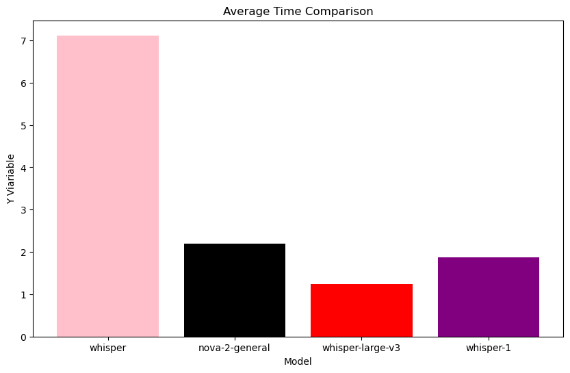
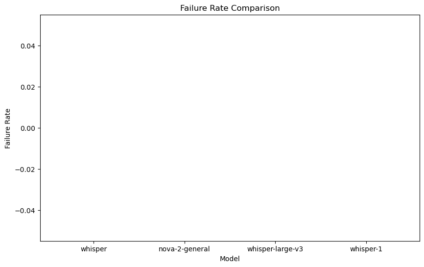

# STT模型横评V2

[🌍English Global](sttv2-en.md)

本文将简要比较四种模型在平均处理时间、失败率、查询长度与处理时间增长、平均WER（单词错误率）与查询长度与WER的变化上的表现差异。


## 参数设置

**对比模型：**

````python
models = ["whisper", "nova-2-general", "whisper-large-v3", "whisper-1"]
````

``whisper``， ``nova-2-general`` 来自Deepgram，``whisper-large-v3``来自Groq，``whisper-1``来自openai。

**模型参数：**

``language`` 为自动识别

其它均为默认

**测试集：**共50条，包含空语音、中日英三语在不同长度的语音。语音包含TTS生成的以及真人朗读。若测试空语音时模型出现幻觉，相对WER将会为100%。

## 测试过程

测试将使用循环逐一遍历测试集，并记录查询长度、处理时长、失败率、WER。每测试10个查询将暂停60秒，以避免超过限制的请求速率等问题。测试集不包括相同文本，因此理论上不存在缓存问题。


## 结果

### 数据摘要：







| Model            | Average Time       | Average WER        | Fail Rate | Overall Query |
| ---------------- | ------------------ | ------------------ | --------- | ------------- |
| whisper          | 7.116141641841216  | 6.856422251015677  | 0.0       | 277.232       |
| nova-2-general   | 2.199721504660214  | 6.178551102556294  | 0.0       | 277.232       |
| whisper-large-v3 | 1.2456307551440071 | 0.4641339869281046 | 0.0       | 277.232       |
| whisper-1        | 1.8660491260827756 | 0.694862552864283  | 0.0       | 277.232       |


## 数据分析

**平均时间：**

由deepgram托管的whisper平均时间过长，显著高于另外三者。Nova-2-general，whisper-1和whisper-large-v3表现相近，但是whisper-large-v3更低。

**平均WER：**

由deepgram托管的whisper和nova-2-general的WER明显高于其它两家。主要原因是其对于非英语语言识别导致，例如：

- 原始文本：机器学习是人工智能的一个分支。

- 识别文本：极 其 学 习 是 人 工 智 能 的 一个 分 支

这样会导致计算出的WER极高。但是无论是whisper还是nova-2-general**都未出现**对于无语音音频的幻觉现象。whisper-1和whisper-large-v3表现优秀，并且whisper-large-v3拥有最佳表现。但是二者均对于无语音音频会出现幻觉。例如传入一个无语音、轻微环境音的音频，会识别为：
````
 几乎整理好後放入冰箱冷却 0.5 cm x 0.4 cm 😆
````

对于正常朗读音频不会出现这种情况。

**查询长度与WER：**

由deepgram托管的whisper和nova-2-general在查询长度增长时WER会显著增加。whisper-1和whisper-large-v3增加较缓。

**查询长度与时间：**

四者均会随着查询长度增长而增加所需时间。由deepgram托管的whisper会平均比其它模型慢5-6秒，nova-2-general、whisper-1和whisper-large-v3时长相似，whisper-large-v3拥有最佳表现。


## 结论

若不考虑无语音幻觉问题，whisper-1与whisper-large-v3表现较佳，其中whisper-large-v3所需时间以及平均WER更为优秀。但是二者均会出现严重的**无语音幻觉问题**。若要使用需开发VAD（声音活跃检测）。

由deepgram托管的whisper和nova-2-general在各方面表现较差，但是**不会出现**无语音幻觉问题。若识别语音仅为英语，且不想额外调研VAD可以使用nova-2-general。由deepgram托管的whisper各方面表现均为最差，**不建议使用**。

---

<p xmlns:cc="http://creativecommons.org/ns#" xmlns:dct="http://purl.org/dc/terms/"><a property="dct:title" rel="cc:attributionURL" href="https://haozhe-li.github.io/LLM-Comparison/">LLM-Comparison</a> by <a rel="cc:attributionURL dct:creator" property="cc:attributionName" href="https://haozhe.li">Haozhe Li</a> is licensed under <a href="https://creativecommons.org/licenses/by-nc/4.0/?ref=chooser-v1" target="_blank" rel="license noopener noreferrer" style="display:inline-block;">CC BY-NC 4.0</a></p>